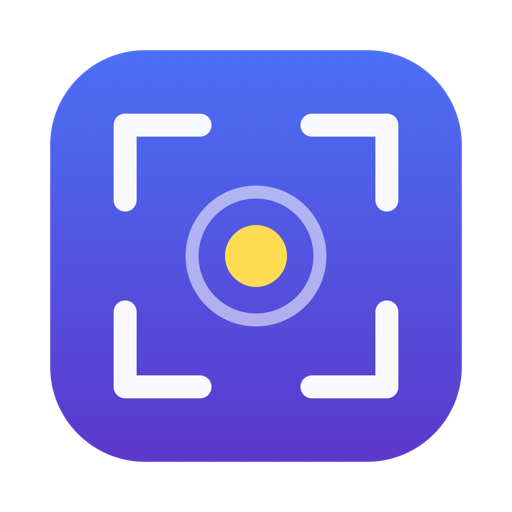
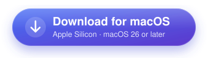
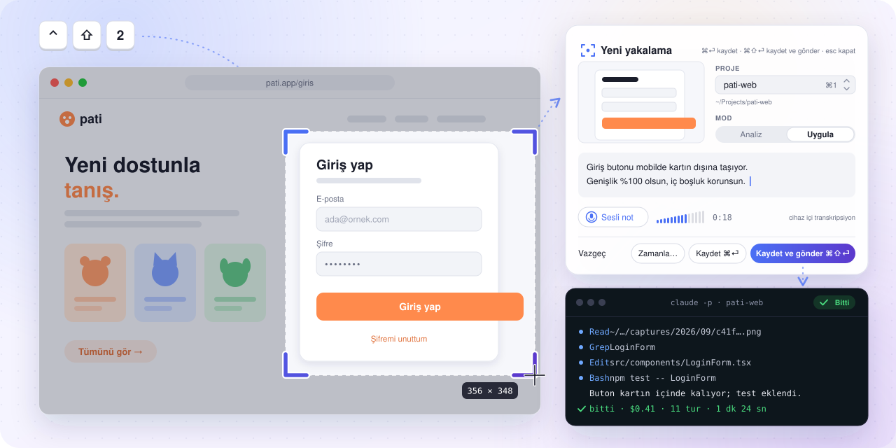
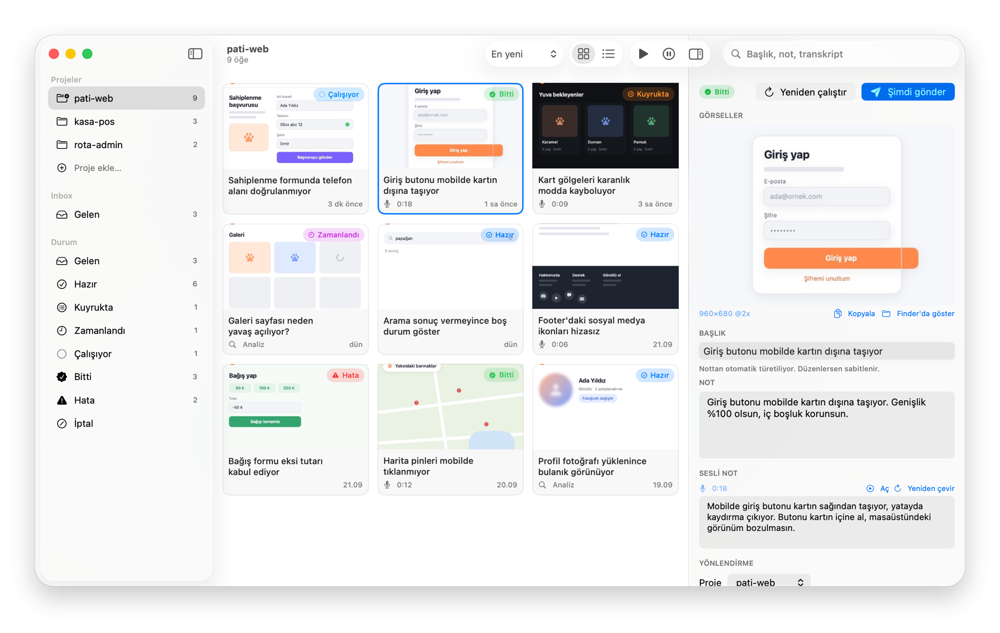
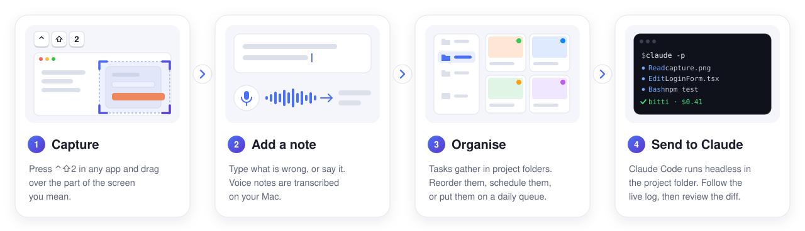
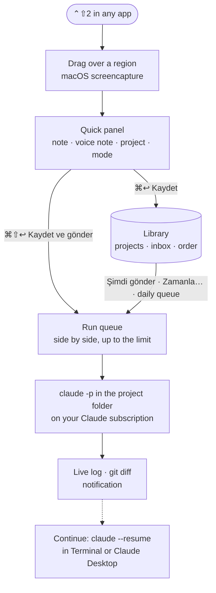
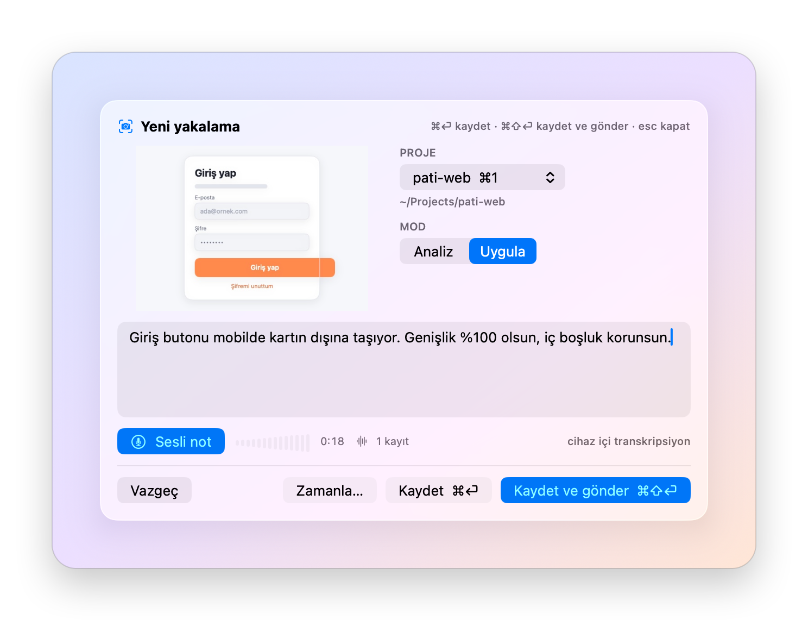
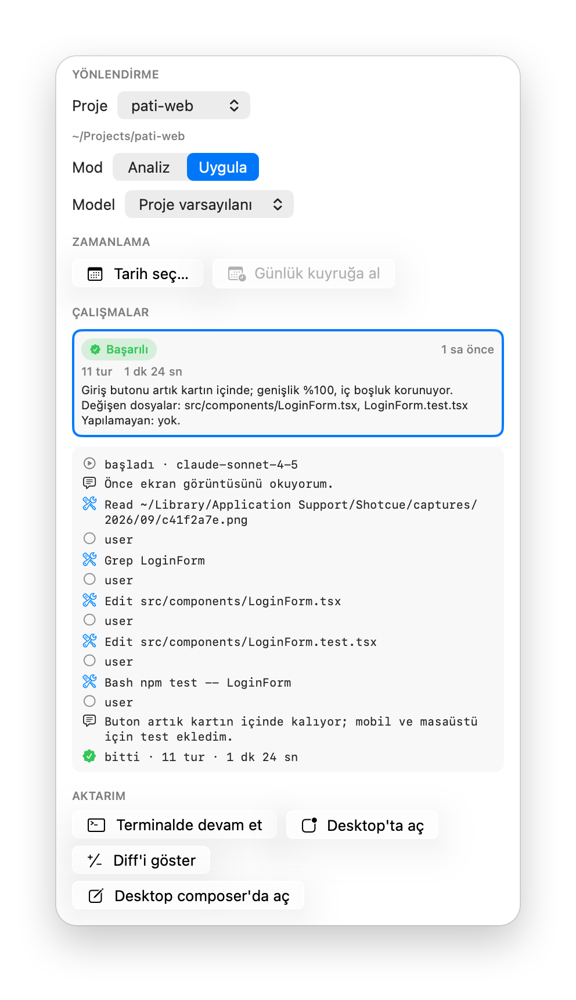
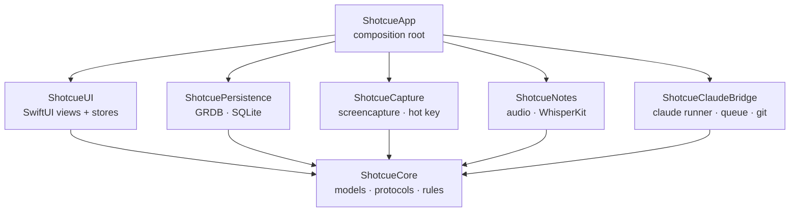

<p align="center"><b>English</b> · <a href="README.tr.md">Türkçe</a></p>

<p align="center">
  
</p>

<h1 align="center">Shotcue</h1>

<p align="center">
  <b>Screenshot → note → Claude Code.</b><br>
  Capture a region of your screen, type or say what is wrong,<br>
  and hand it to Claude Code, running in your project folder.
</p>

<p align="center">
  <a href="https://github.com/egekibar/Shotcue/releases/latest"></a>
  
  
  
  <a href="LICENSE"></a>
</p>

<p align="center">
  <a href="https://github.com/egekibar/Shotcue/releases/latest"></a>
</p>

<p align="center"><sub>Native menu-bar app · no API key: runs on your Claude subscription · <b>the interface is in Turkish</b></sub></p>

<p align="center">
  <picture>
    <source media="(prefers-color-scheme: dark)" srcset="docs/assets/hero-dark.svg">
    
  </picture>
</p>

> [!NOTE]
> **Shotcue's interface is in Turkish**, and voice notes are transcribed in Turkish by default (English can be chosen in Settings). This README quotes the app's Turkish labels as they appear, with the meaning next to them where it helps.

## What it is

Shotcue turns "this looks wrong, fix it" into a task for [Claude Code](https://github.com/anthropics/claude-code). Press a shortcut, drag over the part of the screen you mean, add a typed or spoken note and pick a project. The capture becomes a task in Shotcue's library, grouped by project folder. When you send it, Shotcue runs Claude Code headless (`claude -p`) inside that folder, on your own Claude login: you follow the live log, read the diff, and carry on in Terminal or Claude Desktop.

<p align="center">
  <picture>
    <source media="(prefers-color-scheme: dark)" srcset="docs/assets/library-dark.png">
    
  </picture>
</p>

## Features

<table>
  <tr>
    <td width="33%" valign="top">
      <br>
      <b>Capture in one keystroke</b><br>
      <b>⌃⇧2</b> in any app (or a shortcut you record) starts macOS's own region selection. The quick panel floats over your work without pulling you out of the app you were in.
    </td>
    <td width="33%" valign="top">
      <br>
      <b>Typed or spoken notes</b><br>
      Record a voice note in the panel; WhisperKit transcribes it on your Mac. You can edit the transcript or run it again later.
    </td>
    <td width="33%" valign="top">
      <br>
      <b>A library by project</b><br>
      Tasks gather under project folders and an inbox. Grid or list, drag to reorder or move, search titles, notes and transcripts, merge captures into one task.
    </td>
  </tr>
  <tr>
    <td width="33%" valign="top">
      <br>
      <b>Headless Claude Code</b><br>
      Each task runs as <code>claude -p</code> in its project folder with your Claude subscription, no API key, on the model you pick. Turns, duration and the result are recorded per run.
    </td>
    <td width="33%" valign="top">
      <br>
      <b>Now, later or daily</b><br>
      Send right away, schedule a date and time, or put tasks on a project's daily queue. Runs go side by side, up to a limit you set.
    </td>
    <td width="33%" valign="top">
      <br>
      <b>Review and continue</b><br>
      Watch the live log, compare the changed code file by file, get a notification, and resume the session in Terminal or Claude Desktop.
    </td>
  </tr>
</table>

## How it works

<p align="center">
  <picture>
    <source media="(prefers-color-scheme: dark)" srcset="docs/assets/how-it-works-dark.svg">
    
  </picture>
</p>



- **Capture** uses macOS's own `screencapture -i -s`: you drag a rectangle, Esc cancels. The PNG is stored with a 512 px thumbnail and becomes a task in the inbox.
- **The prompt** lists the absolute paths of the screenshots, your note and the voice-note transcript, and the project folder. Claude is told to read the screenshots first and to finish with a three-line summary, the files it changed and anything it could not do. In *Uygula* (implement) mode it should add or update tests and must not commit or push; in *Analiz* (analyze) mode it must not change any file.
- **The run** is `claude -p` with `--output-format stream-json`, `--session-id <run id>` (so it can be resumed), `--add-dir <captures folder>` (so Claude can read the screenshots), plus the permission mode, turn limit and budget from Settings and, when one is chosen, the model and effort. The working directory is the project folder. `ANTHROPIC_API_KEY` is removed from the environment, so the run uses your Claude Code login; `CLAUDE_CODE_ENTRYPOINT=shotcue` tags it, so Claude Desktop lists the session with your other Claude Code sessions.

## Requirements

| | |
|---|---|
| **macOS** | 26 (Tahoe) or later |
| **Mac** | Apple Silicon |
| **Claude Code** | The `claude` CLI, installed and logged in with your Claude subscription (tested with 2.1.278) |
| **Voice notes** *(optional)* | About 1.6 GB of disk for the default WhisperKit model, downloaded only when you ask (a ~632 MB model is also offered) |
| **Git** *(optional)* | For the diff view and the per-project safety nets (`/usr/bin/git`) |

**How Shotcue finds `claude`:** the path in Ayarlar → Claude → *Yol* if you set one; otherwise `~/.local/bin/claude`, `/opt/homebrew/bin/claude`, `/usr/local/bin/claude`, and finally `which claude` in your login shell (given 3 seconds, in the background). Settings shows the version it found. Without `claude`, sending is refused with an explanation.

## Install

1. Download **`Shotcue-<version>.dmg`** from the [latest release](https://github.com/egekibar/Shotcue/releases/latest).
2. Open it and drag **Shotcue** onto **Applications**.
3. Open Shotcue. It is not notarized, so macOS blocks the first launch. Either:
   - open **System Settings → Privacy & Security**, scroll to the message about Shotcue, click **Open Anyway** and confirm; or
   - run `xattr -dr com.apple.quarantine /Applications/Shotcue.app` in Terminal.

Shotcue lives in the menu bar (a viewfinder icon). It has no Dock icon until you open the library.

> [!IMPORTANT]
> Release builds are **ad-hoc signed** (there is no Apple Developer ID). macOS ties privacy permissions to the signature, so after installing a new version it asks for Screen Recording and Microphone again. If a switch in System Settings is already on but Shotcue still asks, remove Shotcue from that list (–) and grant it again.

## First launch and permissions

| Permission | Used for | |
|---|---|---|
| **Screen Recording** (*Ekran Kaydı*) | capturing a region | required |
| **Microphone** (*Mikrofon*) | voice notes | optional: typed notes work without it |
| **Notifications** (*Bildirimler*) | run results | optional |

On first launch a welcome window (*Shotcue'ya hoş geldin*) lists the three, each with **İzin ver** (grant) or **Sistem Ayarları** (System Settings). Grant Screen Recording and press **Başla**: Shotcue restarts itself so the grant takes effect. Until Screen Recording is granted, the shortcut opens this window instead of capturing. macOS may ask you to confirm Screen Recording again about once a month; that is expected. Ayarlar → İzinler shows the current state at any time.

## Usage

### Capture

Press **⌃⇧2** anywhere and drag over a region (Esc cancels). The quick panel opens in the top-right corner of that display:

<p align="center">
  <picture>
    <source media="(prefers-color-scheme: dark)" srcset="docs/assets/quick-panel-dark.png">
    
  </picture>
</p>

- **Note**: type what is wrong, or click **Sesli not** (⌘⇧V) to record; the recording is transcribed on your Mac in the background, even after the panel closes.
- **Proje** (project): the last one you used is preselected; ⌘1 … ⌘9 pick one of the first nine. Without a project the capture waits in the inbox (*Gelen*).
- **Mod** (mode): *Uygula* (implement: Claude may edit files) or *Analiz* (analyze: read-only). It starts from the project's default.
- **Kaydet ⌘↩** saves · **Kaydet ve gönder ⌘⇧↩** saves and queues the run · **Zamanla…** schedules it · **Esc** closes the panel and leaves the capture in the inbox (a recording in progress is still saved).

The task's title is the first sentence of the note (or of the transcript); edit it in the inspector to pin your own. Ayarlar → Genel can also copy every capture to the clipboard.

**Your own shortcut:** in Ayarlar → Genel, click **Kaydet** next to *Kısayol* and press the combination. It needs ⌘, ⌃ or ⌥ (a function key such as F5 also works on its own); Esc cancels, and **Varsayılan** goes back to ⌃⇧2. If the combination cannot be registered (another app may own it), Shotcue keeps the previous one and says so at the bottom of Settings.

### Library

Open **Kütüphane** (library) from the menu bar. The sidebar lists your projects with task counts, the inbox (*Gelen*) and one filter per status (*Durum*).

- Switch between grid and list; sort by *En yeni*, *En eski*, *Manuel* or *Duruma göre* (newest, oldest, manual, status). Search looks at titles, notes and transcripts, ignoring case and Turkish accents.
- Drag cards onto a project in the sidebar to move them; in manual order, drag them to reorder.
- ⌘-click or ⇧-click selects several. The bar at the bottom then offers **Ayrı ayrı gönder** (one run each), **Tek görev olarak gönder** (merge into one task and one run), **Projeye taşı** (move), **Zamanla…** and **Sil** (delete).
- **Proje ekle…** creates a project: name, folder, default mode, model and effort, the daily queue and the safety nets. Right-click a project for **Proje ayarları…**.
- The inspector (⌥⌘I) shows the selected task: its images (focus one and press ⌘C to copy it), title, note, the editable transcripts (*Aç* plays the recording, *Yeniden çevir* transcribes it again), project, mode, a model override, scheduling, the run history with logs, and the hand-off buttons.

### Keyboard shortcuts

| Where | Keys | Action |
|---|---|---|
| Anywhere | <kbd>⌃</kbd><kbd>⇧</kbd><kbd>2</kbd> | Capture a region (default; record your own in Ayarlar → Genel → *Kısayol*) |
| Quick panel | <kbd>⌘</kbd><kbd>↩</kbd> | Save (*Kaydet*) |
| Quick panel | <kbd>⌘</kbd><kbd>⇧</kbd><kbd>↩</kbd> | Save and send (*Kaydet ve gönder*) |
| Quick panel | <kbd>Esc</kbd> | Close; the capture stays in the inbox |
| Quick panel | <kbd>⌘</kbd><kbd>1</kbd> … <kbd>⌘</kbd><kbd>9</kbd> | Pick project 1–9 |
| Quick panel | <kbd>⌘</kbd><kbd>⇧</kbd><kbd>V</kbd> | Start or stop a voice note |
| Library | <kbd>⌥</kbd><kbd>⌘</kbd><kbd>I</kbd> | Show or hide the inspector |
| Library grid | <kbd>⌫</kbd> | Delete the selected tasks (asks first) |
| Library grid | <kbd>⌘</kbd>-click · <kbd>⇧</kbd>-click | Add to the selection · select a range |
| Inspector | <kbd>⌘</kbd><kbd>C</kbd> | Copy the focused capture |
| Menu bar window | <kbd>⌘</kbd><kbd>L</kbd> · <kbd>⌘</kbd><kbd>,</kbd> · <kbd>⌘</kbd><kbd>Q</kbd> | Library · Settings · Quit |

## Sending to Claude Code

- **Now:** *Kaydet ve gönder* in the panel, **Şimdi gönder** in the inspector or a card's context menu, or the send buttons of the selection bar. The task is queued; the queue starts tasks in manual order, up to *Eş zamanlı çalışma* (concurrent runs, default 2) at a time. Tasks of one project run side by side too, unless the project has a safety net on: then they run one at a time, because a new branch or a stash would pull the working tree out from under a running task.
- **Later:** **Zamanla…** picks a date and time; the task waits as *Zamanlandı* (scheduled).
- **Daily queue:** in a project's settings, turn on *Her gün kuyruğu çalıştır* and pick a time. At that time every *Hazır* (ready) task of the project is queued, in manual order. **Günlük kuyruğa al** marks a task ready for it.
- **Menu bar:** the last five tasks with their status, **Kuyruğu şimdi çalıştır** (queue every ready task now) and **Duraklat / Sürdür** (pause or resume the queue).

Schedules are checked every 30 seconds and when the Mac wakes; a slot missed during sleep runs once, not once per missed tick. Shotcue has to be running for any of this: it installs no background agent.

<p align="center">
  <picture>
    <source media="(prefers-color-scheme: dark)" srcset="docs/assets/inspector-dark.png">
    
  </picture>
</p>

While a task runs, the inspector streams its log live; afterwards it replays the saved log. Every run keeps its turns, duration and result, and the git commit before and after. When a run ends, a notification shows the title and the first line of Claude's summary, with **Aç** (open) and **Terminalde devam et**, or **Yeniden çalıştır** (run again) if it failed. **İptal** (cancel) stops a running task (SIGINT, then SIGKILL after 10 seconds) or takes it out of the queue; quitting Shotcue while runs are going asks first and stops them.

The inspector's hand-off buttons (*Aktarım*):

| Button | What it does |
|---|---|
| **Terminalde devam et** | Opens Terminal in the project folder and runs `claude --resume <session>` |
| **Desktop'ta aç** | Opens the session in Claude Desktop (`claude://code/resume?session=…`) |
| **Diff'i göster** | Opens a code comparison: the changed files with status badges and +/− counts on the left, the selected file's diff with old and new line numbers on the right. It compares against the commit the run started from; untracked files show as added. *Dosyayı kopyala* and *Tümünü kopyala* copy one file's patch or all of it |
| **Desktop composer'da aç** | Opens Claude Desktop's composer with the same prompt Shotcue would send; you press send |

## Settings

The Claude tab (Ayarlar → Claude) applies to every run:

| Setting | Default | |
|---|---|---|
| *Maksimum tur* (max turns) | 50 | 1–500 |
| *Bütçe (USD)* (budget per run, `--max-budget-usd`) | $5 | 0.10–100 |
| *Zaman aşımı* (timeout) | 30 min | 1–480 min |
| *Eş zamanlı çalışma* (concurrent runs) | 2 | 1–20 |
| *Yetki modu* (permission mode, *Uygula* only) | `bypassPermissions` | or `acceptEdits`, `dontAsk` |
| *Model* | Claude Code's default | `fable`, `opus`, `sonnet` or `haiku`; per project and per task too |
| *Effort* | Claude Code's default | per project too |
| *Ek sistem talimatı* (extra system prompt) | empty | appended to Shotcue's own instructions |

*Analiz* tasks always run with `dontAsk` and a read-only tool list (Read, Glob, Grep, WebFetch, WebSearch and `git log/diff/status/show`). A task's model override wins over the project's model, which wins over the default. The other tabs hold the shortcut recorder, clipboard copy, launch at login, *Görev çalışırken Mac'i uyanık tut* (keep the Mac awake while a run is going, on by default), the storage folder, the transcription language and model, the microphone, and the permissions.

## Safety

> [!CAUTION]
> **Runs are unattended and use `--permission-mode bypassPermissions` by default.** In *Uygula* mode Claude Code can edit files and run commands in the project folder without asking, including runs that start from a schedule while you are away. It is told not to commit or push, but that is an instruction, not a sandbox.
>
> - Try Shotcue on a **test repository** first.
> - Turn on the project's safety nets: **Her çalıştırmayı yeni branch'te başlat** (every run starts on a new branch, `shotcue/<task>-<run>`) and **Çalıştırmadan önce değişiklikleri stash'le** (`git stash push -u` before every run). If either git step fails, the run does not start. With a safety net on, the project's tasks run one at a time; with both off, several runs can edit the same folder at once.
> - Keep the limits tight (turns, budget, timeout) and use *Analiz* when you only want an explanation.
> - For more caution, set Ayarlar → Claude → *Yetki modu* to `acceptEdits` or `dontAsk`.

## Privacy

- **Local data.** Everything Shotcue stores stays on your Mac, in `~/Library/Application Support/Shotcue/`: the database (`shotcue.sqlite`), `captures/`, `thumbs/`, `audio/`, `runs/` (the raw run logs) and `models/` (the transcription model). Preferences are in the `com.shotcue.app` defaults domain. The folder can be moved in Ayarlar → Genel → *Depolama*.
- **On-device transcription.** WhisperKit transcribes voice notes on your Mac; the audio never leaves it.
- **No telemetry.** No analytics, crash reporting or accounts; Shotcue has no server. It uses the network only to download the transcription model and its tokenizer from Hugging Face (`argmaxinc/whisperkit-coreml`) after you click *Modeli indir*. Claude Code makes its own connections.
- **What reaches Anthropic** is what Claude Code sends under your login: the prompt (note, transcript, file paths) and whatever Claude reads, including the screenshots and your project files. Don't send captures that show secrets you would not paste into Claude Code.
- **Diagnostics.** *Tanılama çalıştır* (at the bottom of Settings) writes a local report to your temporary folder. From `claude auth status` it copies only `loggedIn`, `authMethod` and `subscriptionType`, never your e-mail address.

## Build from source

Shotcue builds with the **Command Line Tools and SwiftPM alone** (Swift 6.4, macOS 26 SDK): there is no Xcode project.

```sh
git clone https://github.com/egekibar/Shotcue.git
cd Shotcue
make test    # Swift Testing (loads the TestingMacros plugin explicitly)
make build   # debug build
make run     # bundle, install to ~/Applications/Shotcue.app, open
make dmg     # arm64 release bundle → dist/Shotcue-<version>.dmg (+ .sha256)
make cert    # once: a self-signed "Shotcue Dev" code-signing identity
```

- `make bundle` and `make run` sign with the **Shotcue Dev** identity when your keychain has it (`make cert`, then *Always Trust* for code signing in Keychain Access), so macOS should keep the permissions across rebuilds; otherwise they fall back to ad-hoc signing. `make run` stops a running Shotcue before replacing it.
- `make format` and `make lint` run swift-format through `xcrun`; `make reset-tcc` resets Shotcue's Screen Recording and Microphone grants; `make shot` screenshots the running app's windows (your terminal needs Screen Recording).
- The README screenshots are rendered offscreen from the real SwiftUI views with fictional sample data: `SHOTCUE_README_SHOTS=docs/assets make test FILTER='ReadmeScreenshot'`.
- Dependencies (SwiftPM): [GRDB.swift](https://github.com/groue/GRDB.swift) 7.11 and [argmax-oss-swift](https://github.com/argmaxinc/argmax-oss-swift) (WhisperKit) 1.1.

## Architecture



- **ShotcueCore**: Foundation only. Models (`ShotTask`, `Project`, `Run`, …), every service protocol, the task state machine, the prompt builder, the scheduler rules, and the stream-json and unified-diff parsers.
- **ShotcuePersistence**: GRDB on SQLite (WAL): migrations, repositories and the Turkish-aware search.
- **ShotcueCapture**: the `screencapture` wrapper, thumbnails, permission checks and the Carbon global hot key.
- **ShotcueNotes**: the AVAudioEngine recorder (AAC `.m4a`), the WhisperKit transcriber and its background queue.
- **ShotcueClaudeBridge**: the `claude -p` runner, the run queue, the scheduler, git snapshots and diff, Terminal/Desktop hand-off and notifications.
- **ShotcueUI**: SwiftUI views and `@Observable` stores; it reaches services only through Core protocols.
- **ShotcueApp**: the composition root: menu bar, windows, the quick panel, onboarding and settings wiring.

The design spec (`docs/superpowers/specs/`), the implementation plans (`docs/superpowers/plans/`) and the research notes (`docs/research/`) are written in Turkish.

## Known limitations

- The interface is Turkish only.
- Apple Silicon and macOS 26 or later only.
- Not notarized and ad-hoc signed: expect the Gatekeeper prompt on first launch and the permission prompts after each update. *Oturum açılışında başlat* (launch at login) may report itself unavailable for such builds; the strip at the bottom of Settings shows its state, and then you can add Shotcue by hand under System Settings → General → Login Items.
- Region capture only (macOS's `screencapture`): no window picking, annotation or redaction. One capture per panel; merge tasks to send several images together.
- Schedules and the daily queue run only while Shotcue is running and the Mac is awake.
- Transcription uses one language at a time (Turkish or English); the model is a large download the first time.
- A new transcription model, microphone, storage folder or `claude` path takes effect after restarting Shotcue, and moving the storage folder does not move the existing data.
- Shotcue passes Claude Code CLI flags that can change between versions; it was tested with Claude Code 2.1.278.
- *Desktop composer'da aç* passes the screenshots as file links; whether Claude Desktop attaches them depends on Claude Desktop.

## Contributing

Issues and pull requests are welcome. Please read [`CLAUDE.md`](CLAUDE.md) first: it lists the toolchain rules (no Xcode, no `#Preview`, `@UIState` instead of SwiftUI's `@State`) and the APIs to avoid. Keep logic in `ShotcueCore` with Swift Testing tests, run `make test` and `make format` before committing, and write code, identifiers and commit messages in English; UI strings are Turkish.

## License

[MIT](LICENSE) © 2026 Ege Kibar

## Acknowledgements

- [GRDB.swift](https://github.com/groue/GRDB.swift) by Gwendal Roué: the SQLite toolkit behind the library.
- [WhisperKit](https://github.com/argmaxinc/argmax-oss-swift) by Argmax: on-device speech recognition for voice notes.
- [Claude Code](https://github.com/anthropics/claude-code) by Anthropic: the agent Shotcue hands tasks to.

Shotcue is an independent project. It is not affiliated with, or endorsed by, Anthropic or Argmax.
