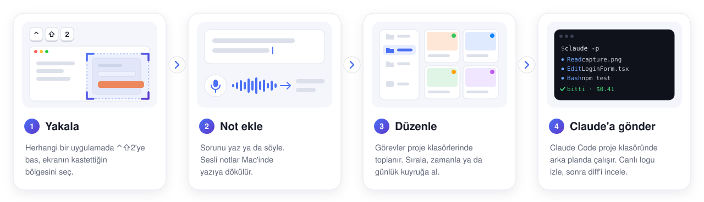
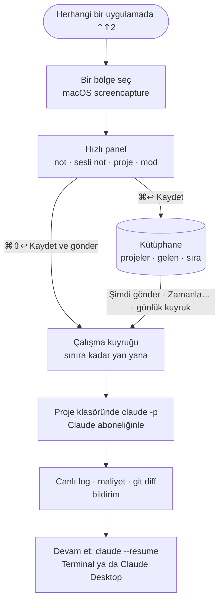
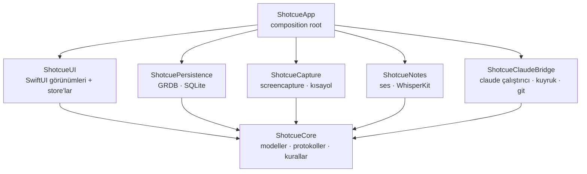

<p align="center"><a href="README.md">English</a> · <b>Türkçe</b></p>

<p align="center">
  
</p>

<h1 align="center">Shotcue</h1>

<p align="center">
  <b>Ekran görüntüsü → not → Claude Code.</b><br>
  Ekranının bir bölgesini yakala, neyin yanlış olduğunu yaz ya da söyle,<br>
  işi proje klasöründe çalışan Claude Code'a devret.
</p>

<p align="center">
  <a href="https://github.com/egekibar/Shotcue/releases/latest"></a>
  
  
  
  <a href="LICENSE"></a>
</p>

<p align="center">
  <a href="https://github.com/egekibar/Shotcue/releases/latest"></a>
</p>

<p align="center"><sub>Yerel menü çubuğu uygulaması · API anahtarı yok: Claude aboneliğinle çalışır · <b>arayüz Türkçe</b></sub></p>

<p align="center">
  <picture>
    <source media="(prefers-color-scheme: dark)" srcset="docs/assets/hero-dark.svg">
    
  </picture>
</p>

> [!NOTE]
> **Shotcue'nun arayüzü Türkçedir** ve sesli notlar varsayılan olarak Türkçe yazıya dökülür (Ayarlar'dan İngilizce seçilebilir). Bu belgedeki buton ve menü adları uygulamada göründüğü gibidir.

## Nedir?

Shotcue, "şurası bozuk, düzelt" demeyi [Claude Code](https://github.com/anthropics/claude-code) için bir göreve çevirir. Kısayola bas, kastettiğin bölgeyi seç, yazılı ya da sesli not ekle, projeyi seç. Yakalama, Shotcue'nun kütüphanesinde proje klasörüne göre gruplanan bir görev olur. Gönderdiğinde Shotcue, Claude Code'u o klasörün içinde headless (`claude -p`) olarak ve senin Claude oturumunla çalıştırır: canlı logu izler, diff'i okur, oturuma Terminal'de ya da Claude Desktop'ta devam edersin.

<p align="center">
  <picture>
    <source media="(prefers-color-scheme: dark)" srcset="docs/assets/library-dark.png">
    
  </picture>
</p>

## Özellikler

<table>
  <tr>
    <td width="33%" valign="top">
      <br>
      <b>Tek tuşla yakalama</b><br>
      Herhangi bir uygulamada <b>⌃⇧2</b> (ya da kaydettiğin kısayol), macOS'un kendi bölge seçimini başlatır. Hızlı panel işinin üstünde süzülür; seni çalıştığın uygulamadan koparmaz.
    </td>
    <td width="33%" valign="top">
      <br>
      <b>Yazılı ya da sesli not</b><br>
      Panelde sesli not kaydet; WhisperKit onu Mac'inde yazıya döker. Transkripti sonradan düzenleyebilir ya da yeniden çevirebilirsin.
    </td>
    <td width="33%" valign="top">
      <br>
      <b>Projeye göre kütüphane</b><br>
      Görevler proje klasörlerinde ve bir gelen kutusunda toplanır. Izgara ya da liste, sürükleyerek sırala ya da taşı; başlık, not ve transkriptte ara; yakalamaları tek görevde birleştir.
    </td>
  </tr>
  <tr>
    <td width="33%" valign="top">
      <br>
      <b>Headless Claude Code</b><br>
      Her görev, proje klasöründe <code>claude -p</code> olarak Claude aboneliğinle ve seçtiğin modelle çalışır; API anahtarı gerekmez. Her çalışmanın tur sayısı, maliyeti ve sonucu kaydedilir.
    </td>
    <td width="33%" valign="top">
      <br>
      <b>Şimdi, sonra ya da her gün</b><br>
      Hemen gönder, bir tarih ve saate zamanla ya da görevleri projenin günlük kuyruğuna al. Çalışmalar, belirlediğin sınıra kadar yan yana yürür.
    </td>
    <td width="33%" valign="top">
      <br>
      <b>İncele ve devam et</b><br>
      Canlı logu izle, değişen kodu dosya dosya karşılaştır, bildirim al; oturuma Terminal'de ya da Claude Desktop'ta devam et.
    </td>
  </tr>
</table>

## Nasıl çalışır?

<p align="center">
  <picture>
    <source media="(prefers-color-scheme: dark)" srcset="docs/assets/how-it-works-dark.tr.svg">
    
  </picture>
</p>



- **Yakalama**, macOS'un kendi `screencapture -i -s` aracını kullanır: bir dikdörtgen çizersin, Esc iptal eder. PNG, 512 px'lik bir küçük resimle saklanır ve gelen kutusunda bir görev olur.
- **Prompt**; ekran görüntülerinin tam yollarını, notunu, sesli not transkriptini ve proje klasörünü içerir. Claude'dan önce ekran görüntülerini okuması ve üç satırlık bir özet, değiştirdiği dosyalar ve yapamadıklarıyla bitirmesi istenir. *Uygula* modunda test eklemesi ya da güncellemesi, commit ve push yapmaması; *Analiz* modunda hiçbir dosyayı değiştirmemesi söylenir.
- **Çalışma**, `--output-format stream-json`, `--session-id <çalışma kimliği>` (devam ettirilebilsin diye), `--add-dir <captures klasörü>` (Claude ekran görüntülerini okuyabilsin diye) ve Ayarlar'daki yetki modu, tur sınırı ve bütçeyle (seçildiyse model ve effort'la da) başlatılan `claude -p`'dir. Çalışma dizini proje klasörüdür. `ANTHROPIC_API_KEY` ortamdan çıkarılır; böylece çalışma Claude Code oturumunu kullanır. `CLAUDE_CODE_ENTRYPOINT=shotcue` çalışmayı etiketler; böylece Claude Desktop oturumu diğer Claude Code oturumlarınla birlikte listeler.

## Gereksinimler

| | |
|---|---|
| **macOS** | 26 (Tahoe) ya da üstü |
| **Mac** | Apple Silicon |
| **Kodlama ajanı** | En az biri: Claude aboneliğinle oturum açılmış `claude` CLI'ı (2.1.278 ile denendi), ChatGPT ile oturum açılmış OpenAI `codex` CLI'ı (0.148 ile denendi) ya da Google'ın Antigravity CLI'ı `agy` (1.2.9 ile denendi) |
| **Sesli notlar** *(isteğe bağlı)* | Varsayılan WhisperKit modeli için yaklaşık 1,6 GB disk; yalnızca sen istediğinde indirilir (~632 MB'lık bir model de sunulur) |
| **Git** *(isteğe bağlı)* | Diff görünümü ve proje güvenlik ağları için (`/usr/bin/git`) |

**Shotcue CLI'ları nasıl bulur:** her ajan için Ayarlar → Ajanlar → *Yol*'a bir yol yazdıysan onu; yoksa bilinen kurulum yerlerini (`~/.local/bin`, `/opt/homebrew/bin`, `/usr/local/bin`; `codex` için ChatGPT.app içindeki kopyayı da) ve son olarak login shell'inde `which <cli>` (arka planda, 3 saniye sınırıyla). Her birinin bulunan sürümü Ayarlar'da görünür. Ajanı bulunamayan görevin gönderimi bir açıklamayla reddedilir.

**Codex ve Antigravity.** Ayarlar → Ajanlar → *Varsayılan ajan* tüm projelerin ajanını seçer; her proje *Proje ayarları*'ndan kendi ajanını seçebilir. Codex görevi `codex exec --json` olarak çalışır (ekran görüntüleri `--image` ile eklenir; *Analiz* salt okunur sandbox'ta, `acceptEdits`/`dontAsk` proje klasörüyle sınırlı sandbox'ta, `bypassPermissions` sandbox'sız). Antigravity görevi `agy -p … --output-format stream-json` olarak çalışır (*Analiz* plan modunda; `bypassPermissions` dışındaki modlarda terminal sandbox'ı açık). İkisinde tur ve bütçe limiti yoktur; zaman aşımı ve eş zamanlılık sınırı geçerlidir. *Terminalde devam et* `codex resume <id>` ya da `agy --conversation <id>` ile devam eder; *Desktop'ta aç* yalnızca Claude Code oturumları içindir.

## Kurulum

### Homebrew

```bash
brew install --cask egekibar/tap/shotcue
```

Cask, [egekibar/tap](https://github.com/egekibar/homebrew-tap) tap'inde duruyor ve kurulumdan sonra karantina işaretini kaldırıyor; böylece Shotcue Gatekeeper uyarısı olmadan açılır. Kısa adı kullanmak için tap'i bir kez ekleyip güvenilir işaretle:

```bash
brew tap egekibar/tap
brew trust egekibar/tap
brew install --cask shotcue
```

Shotcue kendini güncellediği için (aşağıdaki **Güncellemeler**'e bak) `brew upgrade`, `--greedy` verilmedikçe onu atlar. `brew uninstall --zap --cask shotcue` ayrıca `~/Library/Application Support/Shotcue` altındaki verileri de siler.

### DMG

1. [Son sürümden](https://github.com/egekibar/Shotcue/releases/latest) **`Shotcue-<sürüm>.dmg`** dosyasını indir.
2. Aç ve **Shotcue**'yu **Applications** (Uygulamalar) klasörüne sürükle.
3. Shotcue'yu aç. Uygulama notarize edilmediği için macOS ilk açılışı engeller. İki yol var:
   - **Sistem Ayarları → Gizlilik ve Güvenlik**'te Shotcue ile ilgili mesaja in, **Yine de Aç**'a tıkla ve onayla; ya da
   - Terminal'de `xattr -dr com.apple.quarantine /Applications/Shotcue.app` çalıştır.

Shotcue menü çubuğunda yaşar (vizör ikonu). Kütüphaneyi açana kadar Dock'ta ikonu olmaz.

**Güncellemeler.** Shotcue açıldıktan kısa süre sonra ve ardından günde bir kez GitHub Releases'i denetler. Yeni sürüm çıktıysa sürüm notlarını gösterir; **Güncelle** DMG'yi indirir, sürümün SHA-256 dosyasıyla doğrular, uygulamayı değiştirir ve yeniden açar (çalışan görevler, çıkışta olduğu gibi onaydan sonra durdurulur). Menü çubuğundan (*Güncellemeleri denetle…*) ya da Ayarlar → Genel → *Güncellemeler*'den elle de denetleyebilirsin; otomatik denetim oradan kapatılır.

> [!IMPORTANT]
> Yayın derlemeleri **ad-hoc imzalıdır** (Apple Developer ID yoktur). macOS gizlilik izinlerini imzaya bağladığı için yeni bir sürüm kurduktan sonra Ekran Kaydı ve Mikrofon iznini yeniden sorar. Sistem Ayarları'ndaki anahtar açık görünmesine rağmen Shotcue hâlâ izin istiyorsa Shotcue'yu o listeden kaldır (–) ve izni yeniden ver.

## İlk açılış ve izinler

| İzin | Ne için | |
|---|---|---|
| **Ekran Kaydı** | bölge yakalamak | gerekli |
| **Mikrofon** | sesli notlar | isteğe bağlı: yazılı not onsuz da çalışır |
| **Bildirimler** | çalışma sonuçları | isteğe bağlı |

İlk açılışta bir karşılama penceresi (*Shotcue'ya hoş geldin*) bu üç izni **İzin ver** ya da **Sistem Ayarları** düğmeleriyle listeler. Ekran Kaydı iznini ver ve **Başla**'ya bas: Shotcue iznin geçerli olması için kendini yeniden başlatır. Ekran Kaydı izni verilene kadar kısayol yakalama yerine bu pencereyi açar. macOS, Ekran Kaydı iznini ayda bir kez yeniden onaylatabilir; bu beklenen davranıştır. Ayarlar → İzinler güncel durumu her zaman gösterir.

## Kullanım

### Yakalama

Herhangi bir yerde **⌃⇧2**'ye bas ve bir bölge seç (Esc iptal eder). Hızlı panel o ekranın sağ üst köşesinde açılır:

<p align="center">
  <picture>
    <source media="(prefers-color-scheme: dark)" srcset="docs/assets/quick-panel-dark.png">
    
  </picture>
</p>

- **Not**: neyin yanlış olduğunu yaz ya da kaydetmek için **Sesli not**'a (⌘⇧V) tıkla; kayıt, panel kapansa bile arka planda Mac'inde yazıya dökülür.
- **Proje**: son kullandığın proje seçili gelir; ⌘1 … ⌘9 ilk dokuz projeden birini seçer. Projesiz yakalama gelen kutusunda (*Gelen*) bekler.
- **Mod**: *Uygula* (Claude dosyaları düzenleyebilir) ya da *Analiz* (yalnızca okuma). Projenin varsayılanıyla başlar.
- **Kaydet ⌘↩** kaydeder · **Kaydet ve gönder ⌘⇧↩** kaydeder ve çalışmayı kuyruğa alır · **Zamanla…** zamanlar · **Esc** paneli kapatır ve yakalamayı gelen kutusunda bırakır (sürmekte olan kayıt yine de saklanır).

Görevin başlığı notun (yoksa transkriptin) ilk cümlesidir; detay panelinde düzenlersen senin başlığın sabitlenir. Ayarlar → Genel'den her yakalamanın panoya da kopyalanmasını açabilirsin.

**Kendi kısayolun:** Ayarlar → Genel'de *Kısayol*'un yanındaki **Kaydet**'e tıkla ve kombinasyona bas. ⌘, ⌃ ya da ⌥ içermeli (F5 gibi bir F tuşu tek başına da olur); Esc iptal eder, **Varsayılan** ⌃⇧2'ye döner. Kombinasyon kaydedilemezse (başka bir uygulama kullanıyor olabilir) Shotcue öncekini korur ve bunu Ayarlar'ın en altında söyler.

### Kütüphane

**Kütüphane**'yi menü çubuğundan aç. Kenar çubuğu projelerini görev sayılarıyla, gelen kutusunu (*Gelen*) ve her durum için bir filtreyi (*Durum*) listeler.

- Izgara ile liste arasında geçiş yap; *En yeni*, *En eski*, *Manuel* ya da *Duruma göre* sırala. Arama başlıklara, notlara ve transkriptlere bakar; büyük/küçük harf ve Türkçe karakter farkını gözetmez.
- Kartları taşımak için kenar çubuğundaki bir projeye sürükle; manuel sıralamada yeniden sıralamak için sürükle.
- ⌘-tık ya da ⇧-tık birden çok görev seçer. Alttaki çubuk o zaman **Ayrı ayrı gönder** (her biri ayrı çalışma), **Tek görev olarak gönder** (tek görevde ve tek çalışmada birleştir), **Projeye taşı**, **Zamanla…** ve **Sil** sunar.
- **Proje ekle…** bir proje oluşturur: ad, klasör, varsayılan mod, model ve effort, günlük kuyruk ve güvenlik ağları. **Proje ayarları…** için projeye sağ tıkla.
- Detay paneli (⌥⌘I) seçili görevi gösterir: görseller (birini seçip ⌘C ile kopyala), başlık, not, düzenlenebilir transkriptler (*Aç* kaydı çalar, *Yeniden çevir* yeniden yazıya döker), proje, mod, model seçimi, zamanlama, loglarıyla birlikte çalışma geçmişi ve aktarım düğmeleri.

### Klavye kısayolları

| Nerede | Tuşlar | İşlev |
|---|---|---|
| Her yerde | <kbd>⌃</kbd><kbd>⇧</kbd><kbd>2</kbd> | Bölge yakala (varsayılan; kendi kombinasyonunu Ayarlar → Genel → *Kısayol*'da kaydet) |
| Hızlı panel | <kbd>⌘</kbd><kbd>↩</kbd> | Kaydet |
| Hızlı panel | <kbd>⌘</kbd><kbd>⇧</kbd><kbd>↩</kbd> | Kaydet ve gönder |
| Hızlı panel | <kbd>Esc</kbd> | Kapat; yakalama gelen kutusunda kalır |
| Hızlı panel | <kbd>⌘</kbd><kbd>1</kbd> … <kbd>⌘</kbd><kbd>9</kbd> | 1–9. projeyi seç |
| Hızlı panel | <kbd>⌘</kbd><kbd>⇧</kbd><kbd>V</kbd> | Sesli notu başlat ya da durdur |
| Kütüphane | <kbd>⌥</kbd><kbd>⌘</kbd><kbd>I</kbd> | Detay panelini göster ya da gizle |
| Kütüphane ızgarası | <kbd>⌫</kbd> | Seçili görevleri sil (önce sorar) |
| Kütüphane ızgarası | <kbd>⌘</kbd>-tık · <kbd>⇧</kbd>-tık | Seçime ekle · aralık seç |
| Detay paneli | <kbd>⌘</kbd><kbd>C</kbd> | Seçili yakalamayı kopyala |
| Menü çubuğu penceresi | <kbd>⌘</kbd><kbd>L</kbd> · <kbd>⌘</kbd><kbd>,</kbd> · <kbd>⌘</kbd><kbd>Q</kbd> | Kütüphane · Ayarlar · Çık |

## Claude Code'a gönderme

- **Şimdi:** paneldeki *Kaydet ve gönder*, detay panelindeki ya da kartın sağ tık menüsündeki **Şimdi gönder**, ya da seçim çubuğunun gönder düğmeleri. Görev kuyruğa girer; kuyruk görevleri manuel sırayla, aynı anda en fazla *Eş zamanlı çalışma* (varsayılan 2) kadar başlatır. Aynı projenin görevleri de yan yana çalışır; projede bir güvenlik ağı açıksa sırayla çalışırlar, çünkü yeni bir branch ya da stash, çalışan bir görevin altındaki çalışma ağacını değiştirirdi.
- **Sonra:** **Zamanla…** bir tarih ve saat seçer; görev *Zamanlandı* olarak bekler.
- **Günlük kuyruk:** proje ayarlarında *Her gün kuyruğu çalıştır*'ı aç ve bir saat seç. O saatte projenin tüm *Hazır* görevleri manuel sırayla kuyruğa alınır. **Günlük kuyruğa al** bir görevi bunun için hazır yapar.
- **Menü çubuğu:** son beş görev ve durumları, **Kuyruğu şimdi çalıştır** (hazır görevlerin hepsini şimdi kuyruğa al) ve **Duraklat / Sürdür**.

Zamanlamalar 30 saniyede bir ve Mac uykudan uyandığında kontrol edilir; uykuda kaçan bir zaman dilimi bir kez çalışır, kaçan her kontrol için ayrı ayrı değil. Bunların hepsi için Shotcue'nun açık olması gerekir: arka plan ajanı kurmaz.

<p align="center">
  <picture>
    <source media="(prefers-color-scheme: dark)" srcset="docs/assets/inspector-dark.png">
    
  </picture>
</p>

Görev çalışırken detay paneli logu canlı akıtır; bittikten sonra kayıtlı logu yeniden oynatır. Her çalışma tur sayısını, Claude Code'un bildirdiği maliyeti, süreyi, sonucu ve çalışmadan önceki ve sonraki git commit'ini saklar. Çalışma bitince bir bildirim başlığı, Claude'un özetinin ilk satırını ve maliyeti gösterir; **Aç** ve **Terminalde devam et** ya da çalışma başarısızsa **Yeniden çalıştır** düğmeleriyle. **İptal**, çalışan bir görevi durdurur (SIGINT, 10 saniye sonra SIGKILL) ya da görevi kuyruktan çıkarır; çalışmalar sürerken Shotcue'dan çıkmak önce sorar ve onları durdurur.

Detay panelinin aktarım (*Aktarım*) düğmeleri:

| Düğme | Ne yapar |
|---|---|
| **Terminalde devam et** | Terminal'i proje klasöründe açar ve `claude --resume <oturum>` çalıştırır |
| **Desktop'ta aç** | Oturumu Claude Desktop'ta açar (`claude://code/resume?session=…`) |
| **Diff'i göster** | Kod karşılaştırma ekranını açar: solda durum rozetleri ve +/− sayılarıyla değişen dosyalar, sağda seçili dosyanın eski ve yeni satır numaralı diff'i. Çalışmanın başladığı commit'le karşılaştırır; izlenmeyen dosyalar eklenmiş olarak görünür. *Dosyayı kopyala* ve *Tümünü kopyala* bir dosyanın ya da tüm yamanın metnini kopyalar |
| **Desktop composer'da aç** | Claude Desktop'ın yazma alanını Shotcue'nun göndereceği prompt'la açar; göndermeye sen basarsın |

## Ayarlar

Ajanlar sekmesinde (Ayarlar → Ajanlar) varsayılan ajan, her CLI'ın yolu, varsayılan modeli ve effort'u ile her çalışmaya uygulanan şu ayarlar bulunur:

| Ayar | Varsayılan | |
|---|---|---|
| *Maksimum tur* | 50 | 1–500 |
| *Bütçe (USD)* (çalışma başına, `--max-budget-usd`) | 5 $ | 0,10–100 |
| *Zaman aşımı* | 30 dk | 1–480 dk |
| *Eş zamanlı çalışma* | 2 | 1–20 |
| *Yetki modu* (yalnızca *Uygula*) | `bypassPermissions` | ya da `acceptEdits`, `dontAsk` |
| *Model* | CLI'ın varsayılanı | ajan başına (Claude Code: `fable`, `opus`, `sonnet`, `haiku`); proje ve görev başına da seçilir |
| *Effort* | CLI'ın varsayılanı | ajan başına; proje başına da ayarlanır |
| *Ek sistem talimatı* | boş | Shotcue'nun kendi talimatından sonra eklenir |

*Analiz* görevleri her zaman `dontAsk` ve salt okunur bir araç listesiyle (Read, Glob, Grep, WebFetch, WebSearch ve `git log/diff/status/show`) çalışır. Görevin model seçimi projenin modelinden, projenin modeli de varsayılandan önce gelir. Diğer sekmelerde kısayol kaydedici, panoya kopyalama, oturum açılışında başlatma, *Görev çalışırken Mac'i uyanık tut* (varsayılan açık), depolama klasörü, transkripsiyon dili ve modeli, mikrofon ve izinler bulunur.

## Güvenlik

> [!CAUTION]
> **Çalışmalar gözetimsizdir ve varsayılan olarak `--permission-mode bypassPermissions` kullanır.** *Uygula* modunda Claude Code, proje klasöründe sormadan dosya düzenleyebilir ve komut çalıştırabilir; sen yokken zamanlamayla başlayan çalışmalar dahil. Commit ve push yapmaması söylenir, ama bu bir talimattır, sandbox değildir.
>
> - Shotcue'yu önce bir **deneme deposunda** dene.
> - Projenin güvenlik ağlarını aç: **Her çalıştırmayı yeni branch'te başlat** (her çalışma yeni bir `shotcue/<görev>-<çalışma>` dalında başlar) ve **Çalıştırmadan önce değişiklikleri stash'le** (her çalışmadan önce `git stash push -u`). Bu git adımlarından biri başarısız olursa çalışma başlamaz. Bir güvenlik ağı açıkken projenin görevleri sırayla çalışır; ikisi de kapalıyken aynı klasörde birden çok çalışma aynı anda dosya düzenleyebilir.
> - Sınırları dar tut (tur, bütçe, zaman aşımı) ve yalnızca açıklama istediğinde *Analiz* kullan.
> - Daha temkinli olmak için Ayarlar → Ajanlar → *Yetki modu*'nu `acceptEdits` ya da `dontAsk` yap.

## Gizlilik

- **Yerel veri.** Shotcue'nun sakladığı her şey Mac'inde, `~/Library/Application Support/Shotcue/` altında kalır: veritabanı (`shotcue.sqlite`), `captures/`, `thumbs/`, `audio/`, `runs/` (ham çalışma logları) ve `models/` (transkripsiyon modeli). Tercihler `com.shotcue.app` defaults alanındadır. Klasör Ayarlar → Genel → *Depolama*'dan taşınabilir.
- **Cihaz içi transkripsiyon.** Sesli notları WhisperKit Mac'inde yazıya döker; ses Mac'ten çıkmaz.
- **Telemetri yok.** Analitik, çökme raporu ya da hesap yok; Shotcue'nun bir sunucusu yoktur. Ağı yalnızca, *Modeli indir*'e tıkladıktan sonra transkripsiyon modelini ve tokenizer'ını Hugging Face'ten (`argmaxinc/whisperkit-coreml`) indirmek ve güncellemeleri GitHub Releases'ten denetlemek için kullanır (`api.github.com`, günde en fazla bir kez; Ayarlar → Genel → *Güncellemeler*'den kapatılabilir). Claude Code kendi bağlantılarını kendisi kurar.
- **Anthropic'e ulaşan**, Claude Code'un senin oturumunla gönderdikleridir: prompt (not, transkript, dosya yolları) ve Claude'un okudukları; ekran görüntüleri ve proje dosyaların dahil. Claude Code'a yapıştırmayacağın sırları gösteren yakalamaları gönderme.
- **Tanılama.** *Tanılama çalıştır* (Ayarlar'ın en altında) geçici klasörüne yerel bir rapor yazar. `claude auth status` çıktısından yalnızca `loggedIn`, `authMethod` ve `subscriptionType` alanlarını kopyalar; e-posta adresini asla.

## Kaynaktan derleme

Shotcue **yalnızca Command Line Tools ve SwiftPM** ile derlenir (Swift 6.4, macOS 26 SDK): Xcode projesi yoktur.

```sh
git clone https://github.com/egekibar/Shotcue.git
cd Shotcue
make test    # Swift Testing (TestingMacros eklentisini açıkça yükler)
make build   # debug derleme
make run     # paketle, ~/Applications/Shotcue.app'e kur, aç
make dmg     # arm64 release paketi → dist/Shotcue-<sürüm>.dmg (+ .sha256)
make cert    # bir kez: kendinden imzalı "Shotcue Dev" kod imzalama kimliği
```

- `make bundle` ve `make run`, anahtar zincirinde **Shotcue Dev** kimliği varsa onunla imzalar (`make cert`, ardından Anahtar Zinciri Erişimi'nde kod imzalama için *Her Zaman Güven*); böylece macOS'un izinleri yeniden derlemeler arasında koruması beklenir. Kimlik yoksa ad-hoc imzaya düşer. `make run`, çalışan Shotcue'yu değiştirmeden önce kapatır.
- `make format` ve `make lint`, swift-format'ı `xcrun` üzerinden çalıştırır; `make reset-tcc` Shotcue'nun Ekran Kaydı ve Mikrofon izinlerini sıfırlar; `make shot` çalışan uygulamanın pencerelerinin ekran görüntüsünü alır (terminalinin Ekran Kaydı izni olmalı).
- README ekran görüntüleri, gerçek SwiftUI görünümlerinden kurgusal örnek verilerle ekran dışında çizilir: `SHOTCUE_README_SHOTS=docs/assets make test FILTER='ReadmeScreenshot'`.
- Bağımlılıklar (SwiftPM): [GRDB.swift](https://github.com/groue/GRDB.swift) 7.11 ve [argmax-oss-swift](https://github.com/argmaxinc/argmax-oss-swift) (WhisperKit) 1.1.

## Mimari



- **ShotcueCore**: yalnızca Foundation. Modeller (`ShotTask`, `Project`, `Run`, …), tüm servis protokolleri, görev durum makinesi, prompt üretici, zamanlayıcı kuralları, stream-json ve unified diff ayrıştırıcıları.
- **ShotcuePersistence**: SQLite (WAL) üzerinde GRDB: migration'lar, repository'ler ve Türkçeye duyarlı arama.
- **ShotcueCapture**: `screencapture` sarmalayıcısı, küçük resimler, izin kontrolleri ve Carbon global kısayolu.
- **ShotcueNotes**: AVAudioEngine kaydedici (AAC `.m4a`), WhisperKit transkripsiyonu ve arka plan kuyruğu.
- **ShotcueClaudeBridge**: `claude -p` çalıştırıcı, çalışma kuyruğu, zamanlayıcı, git anlık görüntüleri ve diff, Terminal/Desktop aktarımı ve bildirimler.
- **ShotcueUI**: SwiftUI görünümleri ve `@Observable` store'lar; servislere yalnızca Core protokolleri üzerinden ulaşır.
- **ShotcueApp**: composition root: menü çubuğu, pencereler, hızlı panel, karşılama ve ayarların bağlanması.

Tasarım spec'i (`docs/superpowers/specs/`), uygulama planları (`docs/superpowers/plans/`) ve araştırma notları (`docs/research/`) Türkçedir.

## Bilinen sınırlamalar

- Arayüz yalnızca Türkçedir.
- Yalnızca Apple Silicon ve macOS 26 ya da üstü.
- Notarize değil ve ad-hoc imzalı: ilk açılışta Gatekeeper uyarısı ve her güncellemeden sonra izin istekleri beklenir. Bu tür derlemelerde *Oturum açılışında başlat* kullanılamıyor görünebilir; durumu Ayarlar'ın en altındaki şerit gösterir, o durumda Shotcue'yu Sistem Ayarları → Genel → Giriş Öğeleri'nden elle ekleyebilirsin.
- Yalnızca bölge yakalama (macOS'un `screencapture` aracı): pencere seçimi, işaretleme ya da gizleme yok. Panel başına bir yakalama; birden çok görseli birlikte göndermek için görevleri birleştir.
- Zamanlamalar ve günlük kuyruk yalnızca Shotcue açıkken ve Mac uyanıkken çalışır.
- Transkripsiyon tek dille çalışır (Türkçe ya da İngilizce); model ilk seferde büyük bir indirmedir.
- Yeni transkripsiyon modeli, mikrofon, depolama klasörü ya da `claude` yolu Shotcue yeniden başlatılınca geçerli olur; depolama klasörünü değiştirmek mevcut verileri taşımaz.
- Shotcue'nun kullandığı Claude Code CLI bayrakları sürümler arasında değişebilir; Claude Code 2.1.278 ile denendi.
- *Desktop composer'da aç* ekran görüntülerini dosya bağlantısı olarak iletir; Claude Desktop'ın onları ekleyip eklemediği Claude Desktop'a bağlıdır.

## Katkı

Issue ve pull request'ler memnuniyetle karşılanır. Önce [`CLAUDE.md`](CLAUDE.md)'yi oku: araç zinciri kurallarını (Xcode yok, `#Preview` yok, SwiftUI'nin `@State`'i yerine `@UIState`) ve kaçınılacak API'leri listeler. Mantığı Swift Testing testleriyle `ShotcueCore`'da tut, commit'ten önce `make test` ve `make format` çalıştır; kod, tanımlayıcılar ve commit mesajları İngilizce, arayüz metinleri Türkçedir.

## Lisans

[MIT](LICENSE) © 2026 Ege Kibar

## Teşekkürler

- Gwendal Roué'nin [GRDB.swift](https://github.com/groue/GRDB.swift)'i: kütüphanenin arkasındaki SQLite araç takımı.
- Argmax'in [WhisperKit](https://github.com/argmaxinc/argmax-oss-swift)'i: sesli notlar için cihaz içi konuşma tanıma.
- Anthropic'in [Claude Code](https://github.com/anthropics/claude-code)'u: Shotcue'nun görevleri devrettiği ajan.

Shotcue bağımsız bir projedir; Anthropic ya da Argmax ile bağlantılı değildir ve onlar tarafından desteklenmemektedir.
